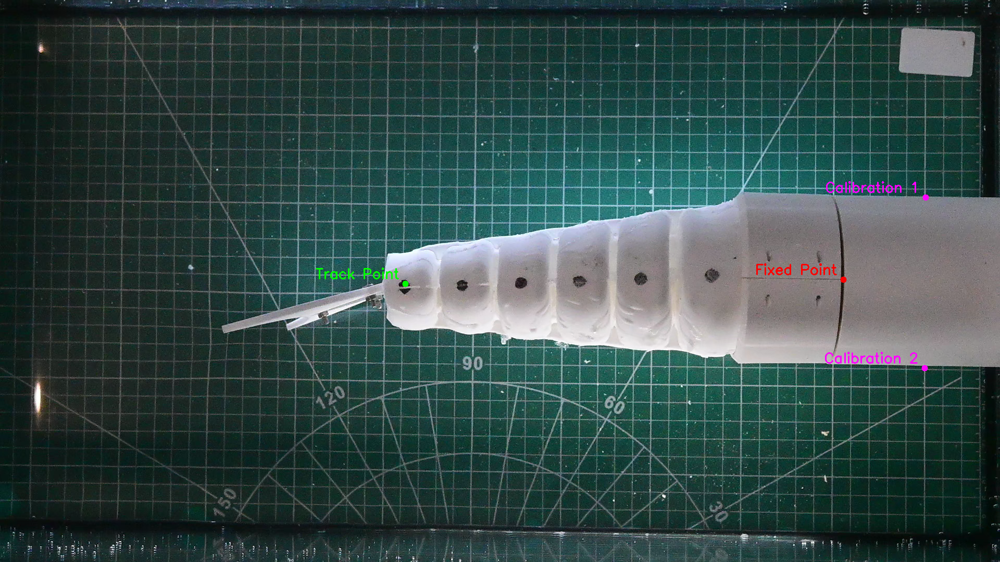

# Fish Motion Tracking
An interesting fish tail oscillation amplitude tracking program. A preview:


### Install Requirements
```
pip install -r requirements.txt
```

### Select Points: Calibration Point 1 -> Calibration Point 2 -> Fixed Point -> Tracking Points (1 or more)

